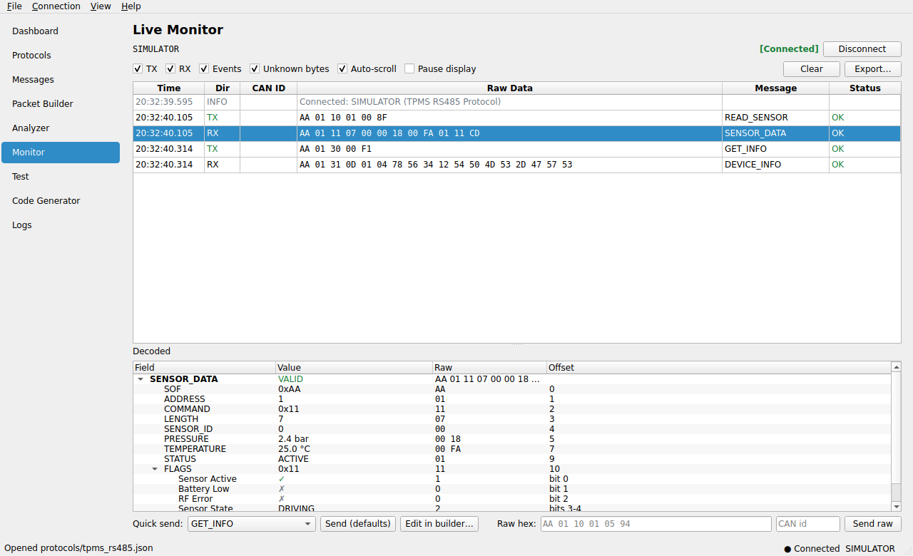
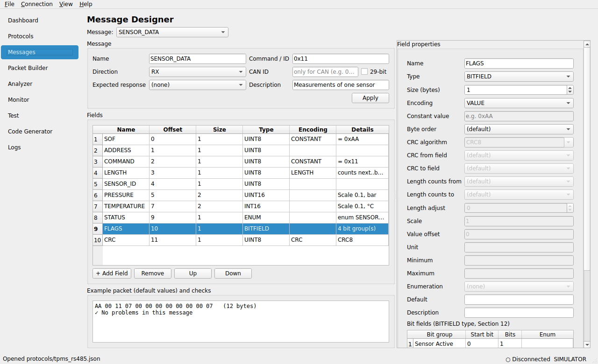
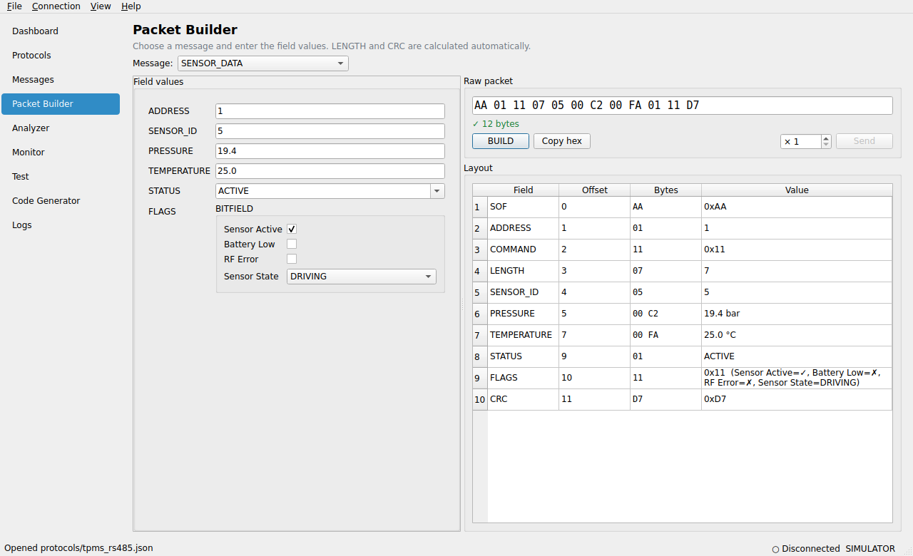
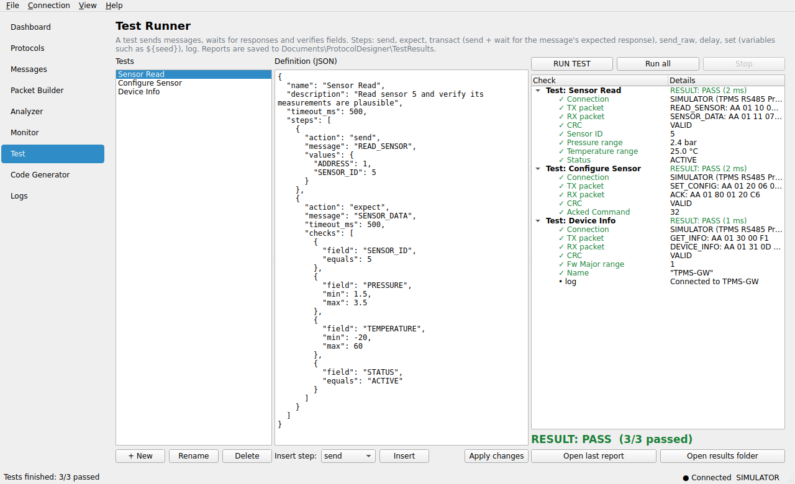
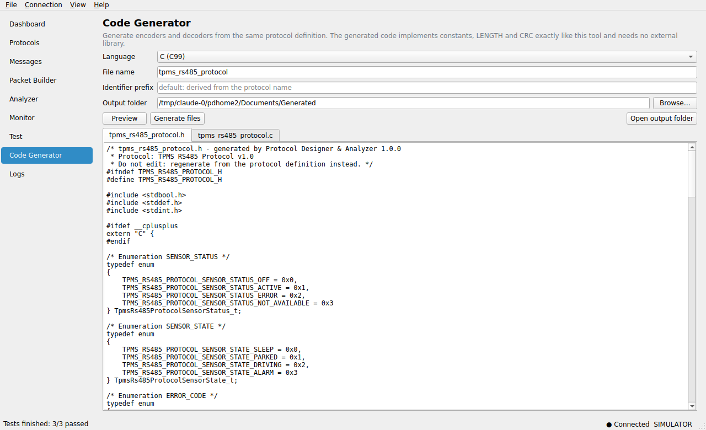

# Protocol Designer & Analyzer

**Protocol Definition, Analysis & Test Platform** — describe a communication protocol once
(messages, fields, CRC, enumerations, scaling, bit fields) and use that single definition to

- **build** packets (LENGTH and CRC are calculated for you),
- **analyse** raw bytes and **monitor** live traffic on RS485, UART, TCP/UDP, CAN and CAN-FD,
- **test** devices automatically with PASS/FAIL reports, including multi-step sequences such as
  a bootloader seed/key unlock,
- **generate** encoder/decoder source code in **C, C++, Python and C#**,
- **document** it: export a complete, printable **PDF specification** of the protocol.

It is a Windows desktop application with a standard installer: a setup wizard with a license
agreement and a choice of install folder, and the program appears under *Settings → Apps →
Installed apps*. It also runs on Linux and macOS from source.

The architecture follows [`Protocol_Designer_Architecture.md`](Protocol_Designer_Architecture.md).



---

## Install on Windows

1. Download **`ProtocolDesigner-Setup-<version>.exe`**:
   - from the repository's **Releases** page (published automatically for every `v*` tag), or
   - from the latest **Build & Test** workflow run → *Artifacts* (GitHub → Actions tab).
2. Run it. The wizard shows:
   **Welcome → License Agreement** (you must choose *I accept*) **→ Install location**
   (default `C:\Program Files\ProtocolDesigner`) **→ Components** (application, example
   protocols, documentation) **→ Additional tasks** (desktop shortcut, `.pdproj` file association)
   **→ Ready → Installing → Finish** (*Launch Protocol Designer & Analyzer now*).
3. Start it from the Start Menu or the desktop shortcut.

The installer is not code-signed yet, so Windows SmartScreen may show *"Windows protected your
PC"*. Click **More info → Run anyway**. See [Code signing](#code-signing) to remove the warning.

**Uninstall** from *Settings → Apps → Installed apps → Protocol Designer & Analyzer → Uninstall*,
or from the Start Menu. Your own protocols, test reports and settings are kept unless you tick
*"Also delete your projects and settings?"*. Installing a newer version upgrades in place and
keeps your data.

| What | Where |
| --- | --- |
| Program (read-only) | `C:\Program Files\ProtocolDesigner\` |
| Your protocols | `Documents\ProtocolDesigner\Protocols\` (examples are copied here on first start) |
| Test reports | `Documents\ProtocolDesigner\TestResults\` |
| Generated code | `Documents\ProtocolDesigner\Generated\` |
| Settings | `%APPDATA%\ProtocolDesigner\settings.json` |
| Logs | `%LOCALAPPDATA%\ProtocolDesigner\logs\` |

## Quick start (no hardware needed)

The example protocols use the built-in **device simulator**, so everything works right away:

1. Start the program. `tpms_rs485.json` opens (menu *File → Open…* for the others).
2. **Monitor** → *Connect* → *Quick send* `READ_SENSOR` → the simulated sensor answers with
   `SENSOR_DATA`. Select a row to see every field decoded: pressure in bar, temperature in °C,
   status names, bit flags, and whether the CRC is valid.
3. **Test** → *Run all* → `RESULT: PASS`. An HTML report is saved in `TestResults`.
4. **Code Generator** → choose C → *Generate files*.

To use real hardware, open **Protocols → Transport** and choose `RS485`/`UART` with your COM port,
`TCP`, or `CAN` with your adapter (PCAN, Vector, Kvaser, IXXAT, slcan, …).

Full walkthrough: [docs/USER_GUIDE.md](docs/USER_GUIDE.md). The file format is described in
[docs/PROTOCOL_FORMAT.md](docs/PROTOCOL_FORMAT.md).

| | |
| --- | --- |
|  |  |
|  |  |

## Command line

`pdcli.exe` is installed next to the application (and registered so `Win+R → pdcli` works).
Its exit codes make it suitable for CI:

```text
pdcli validate  protocols\tpms_rs485.json
pdcli info      protocols\tpms_rs485.json
pdcli encode    protocols\tpms_rs485.json READ_SENSOR ADDRESS=1 SENSOR_ID=5    ->  AA 01 10 01 05 94
pdcli decode    protocols\tpms_rs485.json "AA 01 10 01 05 94"
pdcli test      protocols\tpms_rs485.json --report results --format html     (exit 1 on failure)
pdcli test      protocols\tpms_rs485.json --transport RS485 --port COM3 --baud 115200
pdcli monitor   protocols\tpms_rs485.json --transport RS485 --port COM3 --seconds 30 -v
pdcli generate  protocols\tpms_rs485.json --lang c --out generated
pdcli export    protocols\tpms_rs485.json --out tpms_specification.pdf     (complete PDF specification)
pdcli crc       CRC16_MODBUS "31 32 33 34 35 36 37 38 39"                 ->  0x4B37
pdcli ports
```

## Run from source (any OS)

```bash
python -m venv .venv
.venv\Scripts\activate            # Linux/macOS: source .venv/bin/activate
pip install -r requirements-dev.txt
python -m protocol_designer        # GUI   (add a file path to open it)
python -m protocol_designer cli validate protocols/tpms_rs485.json
```

On Linux, Qt needs `libegl1 libgl1 libxkbcommon0 libfontconfig1`.

## Build the Windows installer

On Windows with Python 3.10+ (64-bit) and [Inno Setup 6.3+](https://jrsoftware.org/isinfo.php)
(`winget install JRSoftware.InnoSetup`):

```powershell
powershell -ExecutionPolicy Bypass -File packaging\build_windows.ps1
```

This runs the tests, builds `dist\ProtocolDesigner\` with PyInstaller (`ProtocolDesigner.exe` and
`pdcli.exe`) and compiles `installer\Output\ProtocolDesigner-Setup-<version>.exe`.

The GitHub Actions workflow [`.github/workflows/build.yml`](.github/workflows/build.yml) does the
same on every push. It also checks the installer end to end with
[`packaging/test_installer.ps1`](packaging/test_installer.ps1):

- silent install, then the *Installed apps* registry entry (name, version, publisher, icon,
  size, uninstall command), files, shortcuts and the `.pdproj` association,
- run the installed CLI and a GUI self-test,
- upgrade to a newer build (still exactly one *Installed apps* entry, user data kept),
- uninstall (entry, files, shortcuts and association removed, user projects kept).

To publish a release: set `__version__` in `src/protocol_designer/__init__.py`, then push the tag
`v<version>`. The installer is attached to the GitHub Release automatically.

### Code signing

Without a signature, SmartScreen warns and the publisher shows as *Unknown*. With an OV/EV
certificate, sign `dist\ProtocolDesigner\*.exe` after PyInstaller and the finished `Setup.exe`
after ISCC:

```powershell
signtool sign /fd sha256 /tr http://timestamp.digicert.com /td sha256 /a <file.exe>
```

## Tests

```bash
QT_QPA_PLATFORM=offscreen python -m pytest -q
```

About 330 tests cover each layer:

| Layer | What is verified |
| --- | --- |
| Protocol engine | every field type in both byte orders, scaling, enums, bit fields, variable-length fields, the 18 CRC algorithms against their standard check values, encoder, decoder, stream frame detection with resynchronisation, validator, JSON load/save round-trips |
| Transports | serial via `loop://`, RS485 echo suppression, TCP client/server, UDP, CAN and CAN-FD on the python-can virtual bus, loopback, device simulator |
| Application | live session, test engine (checks, timeouts, CRC failures, variables, cancel, reports), builder, analyzer, protocol manager, settings, logs, CLI |
| Code generator | the generated **C, C++, Python and C#** is compiled/run and must encode and decode every example message **byte for byte** like the engine, and reject corrupted CRCs |
| GUI | every page driven offscreen with pytest-qt: editing, building, analysing, connecting, running tests, generating code, saving |

## Project layout

```text
src/protocol_designer/
    protocol/      model, field parser, CRC, encoder, decoder, stream detector, validator
    transport/     serial/RS485, TCP/UDP, CAN/CAN-FD, loopback, device simulator
    storage/       JSON loader/writer (.json / .pdproj)
    application/   protocol manager, builder, analyzer, session, test engine, logger, codegen
    ui/            PySide6 pages (Dashboard, Protocols, Messages, Builder, Analyzer, Monitor, Test, Code Generator, Logs)
    cli.py         pdcli
protocols/         example protocols (RS485 sensor, CAN, bootloader sequence)
installer/         Inno Setup script, icon, wizard images
packaging/         PyInstaller spec, Windows build and installer test scripts
tests/             pytest suite
docs/              user guide, protocol format reference
```

## License

See [`src/protocol_designer/resources/EULA.txt`](src/protocol_designer/resources/EULA.txt) (shown
by the installer and under *Help → License*) and
[`THIRD_PARTY_LICENSES.txt`](src/protocol_designer/resources/THIRD_PARTY_LICENSES.txt). The EULA
is a template; have it reviewed before commercial distribution.
